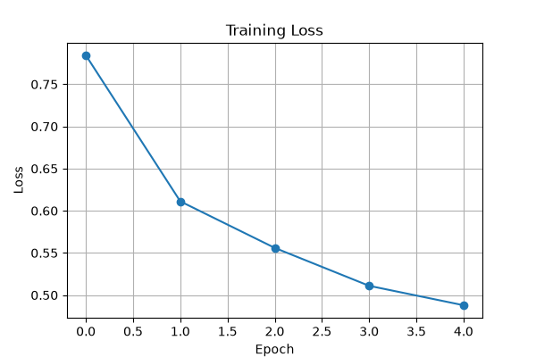
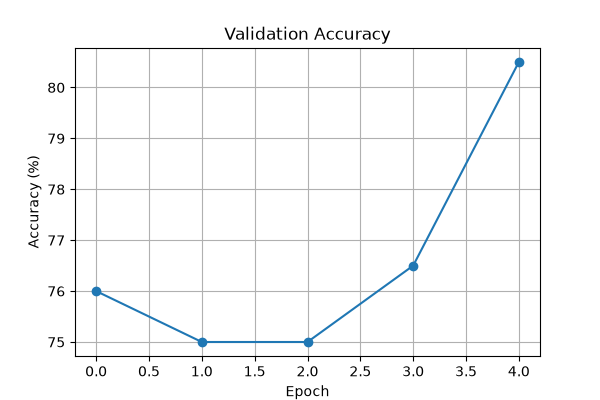

# 🖼️ Image Classification using ResNet-18 on COCO Dataset using PyTorch


A deep learning image classification project built using **PyTorch** and **Transfer Learning** with **ResNet-18**. The project uses a custom subset of the **COCO 2017** dataset to classify images into five categories.

---

# 📌 Project Overview

This project demonstrates an end-to-end image classification pipeline.

The workflow includes:

- Preparing a custom dataset from COCO 2017
- Downloading images
- Creating image labels
- Building a custom PyTorch Dataset
- Training a pretrained ResNet-18 model
- Validating the model
- Saving the best model
- Predicting classes of unseen images

---

# 🚀 Project Highlights

- Transfer Learning using pretrained ResNet-18
- Custom subset of the COCO 2017 dataset
- Automatic dataset preparation pipeline
- Custom PyTorch Dataset and DataLoader
- Achieved **80.5% validation accuracy**
- Saved best model checkpoint
- Prediction on unseen images

---

# 🎯 Objective

To build an image classification model capable of recognizing the following five object categories:

| Label | Class |
|-------|-------|
| 0 | 👤 Person |
| 1 | 🚲 Bicycle|
| 2 | 🚗 Car |
| 3 | 🚌 Bus |
| 4 | 🐶 Dog |

using **Transfer Learning** on **ResNet-18**.

---

# 🛠️ Technologies Used

- Python
- PyTorch
- Torchvision
- OpenCV
- Pillow (PIL)
- Matplotlib
- COCO 2017 Dataset

---

# 🧠 Model

- **Architecture:** ResNet-18
- **Pretrained:** ImageNet
- **Technique:** Transfer Learning
- **Framework:** PyTorch

The pretrained ResNet-18 model is fine-tuned by replacing the final fully connected layer to classify five classes.

---

# 📂 Dataset

Dataset Used:

**COCO 2017**

Selected Classes:

- Person
- Bicycle
- Car
- Bus
- Dog

Dataset Size

| Split      | Images |
|------------|--------|
| Training   | 1000   |
| Validation | 200    |

---

# ⚙️ Training Configuration

| Parameter     | Value            |
|---------------|------------------|
| Optimizer     | Adam             |
| Loss Function | CrossEntropyLoss |
| Learning Rate | 0.001            |
| Batch Size    | 32               |
| Epochs        | 5                |

---

# 📈 Results

## Best Validation Accuracy

# **80.50%**

---

## Training Loss



---

## Validation Accuracy



---

# 📁 Project Structure

```text
image-classification-resnet18-pytorch
│
├── data/
│   ├── annotations/
│   ├── train2017/
│   └── val2017/
│
├── prepare_dataset.py
├── download_images.py
├── create_labels.py
├── dataset.py
├── model.py
├── train.py
├── predict.py
│
├── train_files.txt
├── val_files.txt
├── train_labels.json
├── val_labels.json
│
├── best_model.pth
├── loss.png
├── accuracy.png
│
├── requirements.txt
├── README.md
├── .gitignore
└── LICENSE
```

---

# 🔄 Workflow

```text
COCO Dataset
      │
      ▼
Download COCO Annotations
      │
      ▼
Select Required Classes
      │
      ▼
Prepare Dataset
      │
      ▼
Download Images
      │
      ▼
Generate Labels
      │
      ▼
Create Custom PyTorch Dataset
      │
      ▼
Load Pretrained ResNet-18
      │
      ▼
Train Model
      │
      ▼
Validate Model
      │
      ▼
Save Best Model
      │
      ▼
Generate Accuracy & Loss Graphs
      │
      ▼
Predict New Images
```

---

# 🚀 Getting Started

## 1. Clone the Repository

```bash
git clone https://github.com/riyajayswar/image-classification-resnet18-pytorch.git
```

Move into the project directory.

```bash
cd image-classification-resnet18-pytorch
```

---

## 2. Create a Virtual Environment

Windows

```bash
python -m venv venv
```

---

## 3. Activate the Virtual Environment

Windows PowerShell

```powershell
venv\Scripts\activate
```

---

## 4. Install Dependencies

```bash
pip install -r requirements.txt
```

---

## Dataset Setup

This repository does not include the COCO dataset or annotation files because they are too large for GitHub.

### Step 1: Create the directory structure

```text
data/
├── annotations/
├── train2017/
└── val2017/
```

### Step 2: Download COCO 2017 Annotation Files

Download the following annotation files:

- instances_train2017.json
- instances_val2017.json

Place them inside:

```text
data/
└── annotations/
    ├── instances_train2017.json
    └── instances_val2017.json
```

### Step 3: Run

```bash
python prepare_dataset.py
python download_images.py
python create_labels.py
```

This will automatically prepare the dataset and generate the label files.

# 🏋️ Train the Model

```bash
python train.py
```
Training Complete!
Best Validation Accuracy: 80.50%

Generated:
best_model.pth
loss.png
accuracy.png


The script will:

- Train the model
- Validate after every epoch
- Save the best model
- Generate training graphs

Output files:

```
best_model.pth
loss.png
accuracy.png
```

---

# 🔍 Predict on a New Image

Open `predict.py`

Change

```python
image_path = "data/val2017/example.jpg"
```

to any image you want to classify.

Run

```bash
python predict.py
```

Example Output

```
Prediction: Person
```

---

# 📊 Output Files

| File | Description |
|------|-------------|
| best_model.pth | Trained Model |
| loss.png | Training Loss Graph |
| accuracy.png | Validation Accuracy Graph |

---

# 📌 Future Improvements

- Train on the complete COCO dataset
- Fine-tune additional ResNet layers
- Add Confusion Matrix
- Add Classification Report
- Build a Streamlit web application
- Deploy the model

---

# 📄 License

This project is licensed under the MIT License.
See the LICENSE file for details.

---

# 👩‍💻 Author

**Riya Jayswar**

Deep Learning Internship Project

---

## ⭐ If you found this project useful, consider giving it a star!